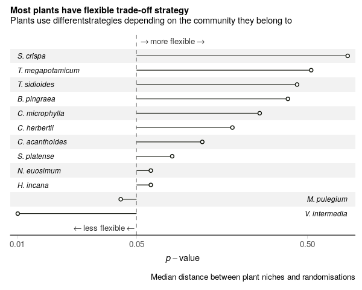

# Community context determines competition/facilitation trade-offs in pollination systems

*__Fernando Cagua__, Hugo Marrero, Jason Tylianakis, and Daniel Stouffer*

We explore the trade offs between competition and facilitation in plants belonging to the same pollination community and find that the community context strongly shapes how plants navigate these trade-offs. 

<br/>
<p align="center">
  
</p>
<br/>

## Summary

Plant-pollinator interactions are commonly viewed as mutualistic. 
However, plants that share pollinators also compete for effective pollination. 
The extent of this competition for pollination and its effects on pollination service are poorly understood at the community level; many species interact simultaneously and multiple intertwined factors might play a role (abundance, visitation, traits). 
By examining comprehensive empirical data, here we show that competition for pollination is pervasive in natural communities and, surprisingly, is only partially influenced by the number of shared pollinators. 
Furthermore, the factors that most influence the pollination service (abundance and visit effectiveness) also introduce a trade-off between the absolute amount of conspecific pollen received and the amount relative to heterospecific pollen. 
Importantly, the ways plants balance these trade-offs depend strongly on the community context, as most species showed flexibility in the strategy they used to cope with competition for pollination. 
Plant-pollinator mutualisms could be better understood as comprising mutualistic and competitive interactions. 

## Reproduce the results

### 1. Check requirements

Make sure that the software and hardware requirements (below) have been met. All code was tested on an x86_64-apple-darwin15.6.0 (64-bit) platform but should everywhere that runs docker:

* Docker 18.09 (might work on other versions but has not been tested)
* 8GB RAM or more

### 2. Run the docker container

There is a couple alternatives here. The easiest one is using the following commands from the working directory.

```
docker build -t pollination-trade-off .
docker run -d -e DISABLE_AUTH=true -p 8787:8787 -v $PWD:/home/rstudio/pollination-trade-off pollination-trade-off-container pollination-trade-off
```

This will build the container image and run it for you. In some systems you will need sudo rights. 

### 3. Run analyses

Just run the makefile in the project directory:

```
docker exec -u rstudio pollination-trade-off-container make -C /home/rstudio/driver-species
```
